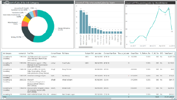
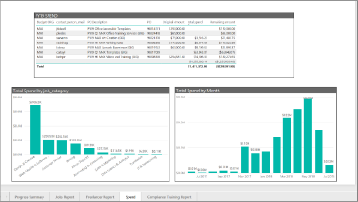

Data analytics case study 
===================

Chad is a director of strategic sourcing, and a procurement leader on the Gig Economy v-team, a cross functional leadership team comprised of product, HR, legal, and procurement. While his full time responsibility is leading an external talent sourcing program spanning 16 countries and 5,000+ assignments per year, he wants to be the procurement lead for the freelance program. To do this, he has three main responsibilities. 

1. Increase internal demand of freelance platforms. 
2. Demonstrate that freelance is skilled, fast, and economical. 
3. Demonstrate that freelance sourcing is a scalable solution, meaning there is enough talent to supply the demands of a 100,000 plus employee enterprise.

Up until now, he’s done the heavy lifting. He has convinced management that freelance isn’t just a flash in the pan. He’s allocated Lora, a strategic sourcing program manager on his team, to focus on operationalizing freelance programs. And he’s identified the KPI’s and benchmarks needed to define success.  

But as the program progresses he notices a giant flaw: he doesn’t have the tools to track and communicate progress to his management. He can talk about the success stories, but without reliable data, he’s left communicating nothing but educated guesses.

While talking with Radhika, a PM leading support content, Radhika mentions PowerBI, a suite of business analytics tools to track, monitor, and benchmark progress. Excited, he tasks Lora with implementing PowerBI, but within the first month they realize the data is unreliable and they don’t have the necessary talent to build the interactive data visualization. When he goes back to Radhika, they both agree that the freelance program can’t validate success without a measure to track, monitor, and benchmark progress. 

They decide to work with Upwork to find experts in PowerBI that could build the necessary data visualizations, while working with Upwork’s product team to build the necessary data connector. In a matter of a month, the first version of an interactive data visualization is built, and immediately the value is realized. They can immediately see key metrics such as:

- Avg. time to hire
- Spend per job category 
- Avg. spend per contract 
- Avg. contract duration 

With Chad’s first responsibility of increasing demand, he can analyze the demand by the jobs category, the teams, and the exact individuals who posted each job. 

He can also see this demand through spend, filtering it by total spend per job category, total spend per month, and even spend per full time employee. 

Chad can also put his freelance dashboards side by side with the external staffing dashboards to perform relevant analysis and comparisons. 
