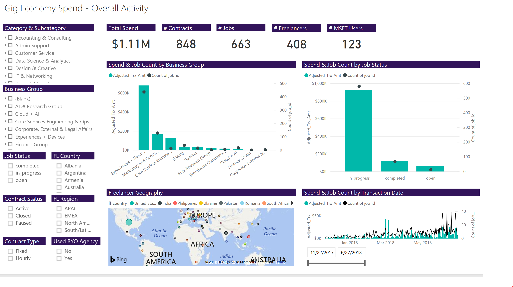

H1: Data Analytics 
===================

Data Analytics with PowerBI 
----------------------------

What if you could collect and customize real time data to make data-driven
business decisions about your freelance program?

For Chad, a director of strategic sourcing, and a procurement leader on the Gig
Economy v-team, he leverages real time data to show upper management that
freelance isn’t just a flash in the pan. That instead, by comparing it side by
side with existing external staffing options, it is consistently better, faster,
and cheaper by leaps and bounds.

[Learn how Chad increased spend and adoption by leveraging a data-centric
approach](https://microsoft.sharepoint.com/:w:/r/teams/OfficeandtheGigEconomy/_layouts/15/Doc.aspx?sourcedoc=%7BF7970B74-4DDA-4C39-A732-A067B09FA482%7D&file=Data%20Analytics%20Case%20Study.docx&action=default&mobileredirect=true)

Challenge in the Enterprise
---------------------------

A major challenge in scaling an enterprise program is tracking and communicating
business performance via enterprise specific KPI’s. Due to the volume and
complexity within your enterprise, data is not only hard to capture, but hard to
communicate effectively.

This effects:

-   Your ability to make data-driven decisions

-   Your ability to compare freelance spend with existing external staffing
    options

-   Your ability to identify which groups within your organization and which
    freelance talent categories work best within your organization

With [Microsoft PowerBI](https://powerbi.microsoft.com/en-us/), a suite of
business analytics tools, you can collect end-to-end, real time data from every
source, and customize data visualization dashboards.

Learn More with the following resources: 
-----------------------------------------

**Case Study**

Learn how Chad, a director of strategic sourcing, and a procurement leader on
the Gig Economy v-team, increased spend and adoption of the freelance program by
leveraging a data-centric approach.

-   [Learn
    More](https://microsoft.sharepoint.com/:w:/r/teams/OfficeandtheGigEconomy/_layouts/15/Doc.aspx?sourcedoc=%7BF7970B74-4DDA-4C39-A732-A067B09FA482%7D&file=Data%20Analytics%20Case%20Study.docx&action=default&mobileredirect=true)

**Deploy PowerBI Dashboard**

Start building your PowerBI dashboard today with our prepopulated template. The
template is completely customizable, but we have curated many of our best
practices into the template. Enjoy!

-   [Download Your PowerBI
    Dashboard](https://github.com/upwork/powerbi-upwork/blob/master/docs/img/upworkpowerbireport.png)

**PowerBI Hiring Template**

Start customizing your PowerBI Dashboard in accordance with your enterprise
today. We have curated many of our hiring best practices, including the ideal
job description, skills needed, and price point.

-   [Download Your PowerBI Hiring
    Template](https://docs.google.com/document/d/1aMRsMNNKtO3JYqqf5mBlZIk9cYiPoOCVUCXFIH9IbQ8/edit?pli=1)

**Share Within Your Organization**

Start sharing how to leverage a data-driven approach with this PowerBI visual
one-page guide.

-   [Download Your Tear
    Sheet](https://microsoft.sharepoint.com/teams/OfficeandtheGigEconomy/Shared%20Documents/Forms/AllItems.aspx?id=%2Fteams%2FOfficeandtheGigEconomy%2FShared%20Documents%2FGeneral%2FWhitepaper%2FTearsheet%20Comparable%2Ejpg&parent=%2Fteams%2FOfficeandtheGigEconomy%2FShared%20Documents%2FGeneral%2FWhitepaper)
