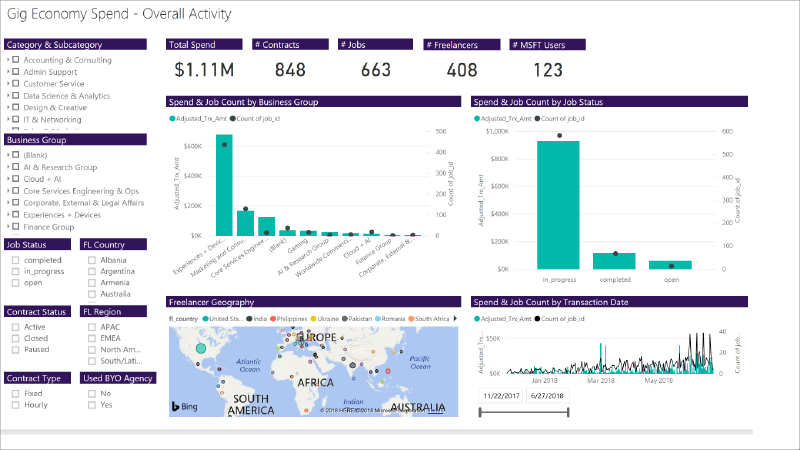

Data analytics 
===================

Data analytics with PowerBI 
----------------------------

What if you could collect and customize real time data to make data-driven
business decisions about your freelance program?

For Chad, a director of strategic sourcing, and a procurement leader on the Gig
Economy v-team, he leverages real time data to show upper management that
freelance isn’t just a flash in the pan. That instead, by comparing it side by
side with existing external staffing options, it is consistently better, faster,
and cheaper by leaps and bounds.

[Learn how Chad increased spend and adoption by leveraging a data-centric
approach](dataanalyticscasestudy.md)

Challenge in the enterprise
---------------------------

A major challenge in scaling an enterprise program is tracking and communicating
business performance via enterprise specific KPI’s. Due to the volume and
complexity within your enterprise, data is not only hard to capture, but hard to
communicate effectively.

This effects:

-   Your ability to make data-driven decisions

-   Your ability to compare freelance spend with existing external staffing
    options

-   Your ability to identify which groups within your organization and which
    freelance talent categories work best within your organization

With [Microsoft PowerBI](https://powerbi.microsoft.com/en-us/), a suite of
business analytics tools, you can collect end-to-end, real time data from every
source, and customize data visualization dashboards.

Learn more with the following resources
-----------------------------------------
<ul class="panelContent cardsF cols cols2">
    <li>
        

            

                

                    

                        

                            
                        

                    

                    

                        <h3>Case study</h3>
                        
Learn how Chad, a director of strategic sourcing, and a procurement leader on the Gig Economy v-team, increased spend and adoption of the freelance program by leveraging a data-centric approach.

                        
<a href="dataanalyticscasestudy.md">Learn more</a>

                    

                

            

        

    </li>
    <li>
        

            

                

                    

                        

                            
                        

                    

                    

                        <h3>Deploy PowerBI dashboard</h3>
                        
Start building your PowerBI dashboard today with our prepopulated template. The template is completely customizable, but we have curated many of our best practices into the template. Enjoy!

                        
<a href="https://microsoft.sharepoint-df.com/teams/MSFTUpworkTeam/Shared%20Documents/Expert%20Marketplace/SharePoint%20Comms%20Site.PNG">Deploy communications site</a>

                    

                

            

        

    </li>
    <li>
        

            

                

                    

                        

                            
                        

                    

                    

                        <h3>PowerBI engagement template</h3>
                        
Start customizing your PowerBI Dashboard in accordance with your enterprise today. We have curated many of our engagement best practices, including the ideal job description, skills needed, and price point.

                        
<a href="powerbiengagementtemplate.md">View the PowerBI engagement template</a>

                    

                

            

        

    </li>
    <li>
        

            

                

                    

                        

                            
                        

                    

                    

                        <h3>Share within your organization</h3>
                        
Download an infographic to share how your organization can drive awareness amongst internal stakeholders and adopters with this PowerBI visual one-page guide.

                        
<a href="">Download the infographic</a>

                    

                

            

        

    </li>
</ul>

