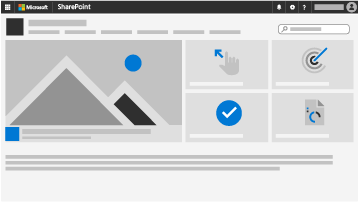
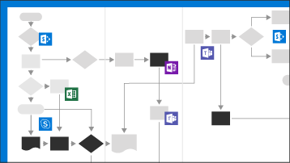

Launch your freelance program
=================================

The Microsoft 365 toolkit is an a-la-carte solution to launch and execute
enterprise freelance programs at scale. It provides information about available
tools, templates and best practices, but each enterprise will need to evaluate
and determine its own requirements, including such things as its data handling
and compliance needs.

Early in our journey we realized just how lucky we were to be a leading
productivity technology company. While the benefits of leveraging freelancers
were clear, the operations were a little less certain for an enterprise at our
size and complexity.

The below picture shows our first attempt at operationalizing:

*Screenshot of the original Visio Operations doc*

We pieced together many of our technologies, including SharePoint to provide a
central intranet site for employees to learn and engage with the program. Teams
to collaborate with both freelancers and full time employees. PowerBi to measure
success compared with alternative external staffing options. And Flow to button
up manual processes through intelligent automation. It wasn’t perfect, but we
offered a seamless experience to our users and grew significant adoption of the
program.

Having realized our mission is to empower the world to do more, we realized we’d
be hypocritical if we didn’t open up our own internal transformation to our
customers. Thus the Microsoft 365 Freelance Toolkit was born, a curation of
tools, deployment templates, and best practices for enterprises to launch and
execute freelance programs at scale leveraging their current M365 stack as they
determine appropriate based on their requirements and needs.

The toolkit is broken up into 4 module’s with no interdependencies. It can be
followed in any order and at any time, so long as you have the necessary
technologies:
- Microsoft SharePoint
- Microsoft Teams
- Microsoft PowerBI
- Microsoft Flow

Start building your own freelance program through the toolkit

<ul class="panelContent cardsW cols cols2">
    <li>
        

            

                

                    

                        

                            
                        

                    

                    

                        <h3>Build your communications site with SharePoint</h3>
                        
One of the major challenges of launching a freelancer program in the enterprise is driving awareness amongst internal stakeholders and adopters. The Sharepoint Communication Site is a template intranet website that is designed to be your employees one-stop-shop for everything they need to know about the program.

                    

                

            

        

    </li>
    <li>
        

            

                

                    

                        

                            
                        

                    

                    

                        <h3>Collaboration with Microsoft Teams</h3>
                        
While today’s freelancer tools work fine for 1:1 discussions, most enterprise projects are many:many where team members collaborate on projects in groups. Microsoft Teams is your hub application that supports integration with Microsoft applications as well as hundreds of 3rd party applications like Trello that your teams use to get work done. 

                    

                

            

        

    </li>
    <li>
        

            

                

                    

                        

                            
                        

                    

                    

                        <h3>Track, monitor, and manage success leveraging data analytics with PowerBI</h3>
                        
You will need a suite of business analytics tools so that you can track, monitor, and benchmark success both with your freelance program, and how your freelance program is performing against other external sourcing options. PowerBI is your one-stop-shop to collect real-time data from every source and visualize this data through dashboards that highlight the KPI’s needed for a successful program within your enterprise.

                    

                

            

        

    </li>
    <li>
        

            

                

                    

                        

                            
                        

                    

                    

                        <h3>Start automating your workflows with Microsoft Flow</h3>
                        
You will need to create an end to end process to operationalize and govern the freelance program in the company. Microsoft Flow is your solution to streamlining this process vs. creating complexity. 

                    

                

            

        

    </li>
</ul>
