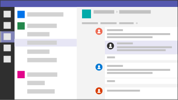
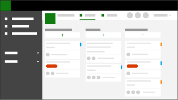
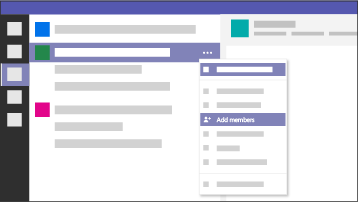

Team-wide collaboration
===========================

Microsoft Teams 
--------------------

What if you could increase output 120% by internally transforming the way your
teams work?

For Beth, a training manager leading a team of four full time employees and a
continuous flow of freelancers to create training videos, she needed to create
150 training videos in six weeks – a feat unattainable with her then current
capacity. By leveraging Microsoft teams as her teams one place for
communication, collaboration, and project management, she was able not only to
hit her teams goal two weeks early, but bring an internal transformation
solution to her entire 150 person organization.

[Learn how Beth internally transformed her hybrid full time employee and
freelance teams](teamwidecollaborationcasestudy.md)

Challenge in the Enterprise
---------------------------

While today’s freelancer tools work fine for 1:1 discussions, most enterprise
projects are many:many where team members collaborate on projects in groups with
many different working files and communication channels. In order to keep teams
moving in the same direction while on various continents and various roles, they
need one place to communicate and collaborate. Specifically, these teams need,
all in one place, the ability to:

<ul class="panelContent cardsW cols cols2">
    <li>
        

            

                

                    

                        

                            
                        

                    

                    

                        <h3>Communicate</h3>
                        
Like Slack, public and private channels for members to engage in discussion. This discussion needs to be visible for all applicable stakeholders to promote virtual collaboration.

                    

                

            

        

    </li>
    <li>
        

            

                

                    

                        

                            
                        

                    

                    

                        <h3>Manage tasks</h3>
                        
Like Trello, one place to track progress and align each team members workflow through popular project management techniques. 

                    

                

            

        

    </li>
    <li>
        

            

                

                    

                        

                            
                        

                    

                    

                        <h3>Collaborate</h3>
                        
Like cloud-based file storage, in order to avoid team members working on prior versions of files, they need one place to store files, ideally stored in the boards/tickets created in the project management application, and the ability to be seamlessly retrieved through intelligent search. 

                    

                

            

        

    </li>
    <li>
        

            

                

                    

                        

                            
                        

                    

                    

                        <h3>Invite external users</h3>
                        
Like open-sourced technology, the ability to be broadly accepted for freelancers by having a free option. <a href="https://products.office.com/en-us/microsoft-teams/free">Learn about Microsoft Teams free download</a>.

                    

                

            

        

    </li>
</ul>

[Microsoft Teams](https://products.office.com/en-us/microsoft-teams/free) is
your hub application that supports integration with Microsoft applications as
well as hundreds of 3rd party applications like Trello that your teams use to
get work done. This section will help you learn:

Learn more with the following resources
---------------------------------------

<ul class="panelContent cardsF cols cols2">
    <li>
        

            

                

                    

                        

                            
                        

                    

                    

                        <h3>Case study</h3>
                        
Learn how Beth, a training manager leading a team of four full time employees and a continuous flow of freelancers, increased her teams training video output by 120% through internally transforming the way they communicated, collaborated, and project managed the production of training videos.

                        
<a href="workflowautomationcasestudy.md">Learn more</a>

                    

                

            

        

    </li>
    <li>
        

            

                

                    

                        

                            
                        

                    

                    

                        <h3>Share within your organization</h3>
                        
Download an infographic to share how your organization can internally transform the way you communicate, collaborate, and project manage a hybrid full-time-employee and freelance workforce.

                        
<a href="">Download the infographic</a>

                    

                

            

        

    </li>
</ul>

