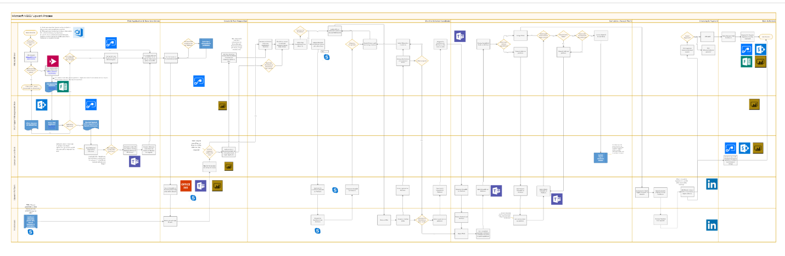

Workflow Automation
===================

As a program administrator, what if you could focus on value driving activities
like engagement and retention instead of repetitive manual tasks like data
input?

For Liane, a freelance program manager, she was able to automate workflows using
if this, then that, logic between the various applications she was manually
processing, including but not limited to:

-   From compliance training videos to email follow ups and creation of a user’s
    profile on the talent management platform

-   From a user’s first project application to email follow ups on whether the
    project was accepted or denied

-   From newsletter signups, to databases and groups

By automating these administrative, operational, and manual tasks, Liane was
able to focus on growing demand and retention within the program by providing a
frictionless experience for the end user.

[Learn how Liane used if this, then that, logic to automate repetitive, manual
tasks within a freelance
program](https://microsoft.sharepoint.com/:w:/r/teams/OfficeandtheGigEconomy/_layouts/15/Doc.aspx?sourcedoc=%7BE1A57D66-675B-4303-A430-7620A9BB0B61%7D&file=Workflow%20Automation%20Case%20Study.docx&action=default&mobileredirect=true)

Challenge in the Enterprise
---------------------------

While unchecked workflows can fit in an infographic, the real end-to-end process
required to operationalize and govern a freelance program looks like below:

It is hard to streamline vs. create complexity. Especially, for an enterprise
not born in the cloud. A freelance program requires provisioning, compliance,
monitoring, all while increasing demand by providing a frictionless process for
the end user.

With [Microsoft Flow](https://flow.microsoft.com/en-us/), you can create
automated workflows between your favorite apps and services to get
notifications, synchronize files, collect data, and more.

**Case Study**

Learn how Liane, a freelance program manager, was able to focus on high value
adding tasks like demand generation and creating a frictionless end user
experience, by automating administrative, operational, and manual workflows.

-   [Learn
    More](https://microsoft.sharepoint.com/:w:/r/teams/OfficeandtheGigEconomy/_layouts/15/Doc.aspx?sourcedoc=%7BE1A57D66-675B-4303-A430-7620A9BB0B61%7D&file=Workflow%20Automation%20Case%20Study.docx&action=default&mobileredirect=true)

**Deploy Flow Product Templates**

Start building your communications site today with our prepopulated template.
The communications site template is completely customizable, but we have curated
many of our best practices into the template. Enjoy!

-   [Deploy Flow Product
    Templates](https://preview.flow.microsoft.com/en-us/templates/)

**Flow Hiring Template**

Start customizing your flow templates in accordance with your enterprise today.
We have curated many of our hiring best practices, including the ideal job
description, skills needed, and price point.

-   [Download Your Flow Hiring
    Template](https://docs.google.com/document/d/1aMRsMNNKtO3JYqqf5mBlZIk9cYiPoOCVUCXFIH9IbQ8/edit?pli=1)

**Share Within Your Organization**

Download our tear-sheet to share how your organization can drive awareness
amongst internal stakeholders and adopters with this visual one-page guide.

-   [Download Your Tear
    Sheet](https://microsoft.sharepoint.com/teams/OfficeandtheGigEconomy/Shared%20Documents/Forms/AllItems.aspx?id=%2Fteams%2FOfficeandtheGigEconomy%2FShared%20Documents%2FGeneral%2FWhitepaper%2FTearsheet%20Comparable%2Ejpg&parent=%2Fteams%2FOfficeandtheGigEconomy%2FShared%20Documents%2FGeneral%2FWhitepaper)
